## Accounts and services

1. Sign up for a free [IBM Cloud account](https://cloud.ibm.com/).
2. Sign up for a free [Watson Studio account](https://dataplatform.ibm.com/).
3. Provision a free lite instance of [Watson Machine Learning](https://cloud.ibm.com/catalog/services/machine-learning). **Choose either the Dallas or Frankfurt region.**
4. Provision a free lite instance of [Watson OpenScale](https://cloud.ibm.com/catalog/services/watson-openscale). **Choose the same region (Dallas or Frankfurt) you selected for Watson Machine Learning.** You just need to provision the service for now. **DO NOT RUN THE AUTO-SETUP DURING THE WEBCAST.** It will take too much time to complete and you won't be able to follow along.
5. Provision a free instance of [Object Storage](https://cloud.ibm.com/catalog/services/cloud-object-storage).

## Setup
In this step, you will create the service credentials and projjects you need for the hands-on lab.

Start by creating credentials for Watson Machine Learning. Navigate to your [IBM Cloud Resources page](https://cloud.ibm.com/resources). From the **Resource list**, expand the **Services** section and click on the instance of Watson Machine Learning you created in the previous section.

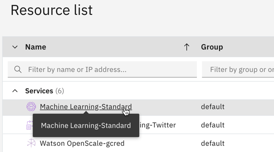

From the menu on the left, click on **Service credentials**.

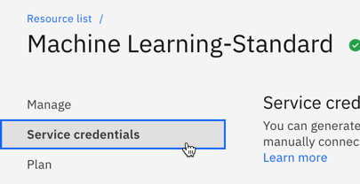

Click blue the **New credential** button.

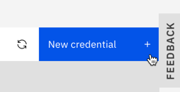

Give your credentials a name, and then click the **Add** button.

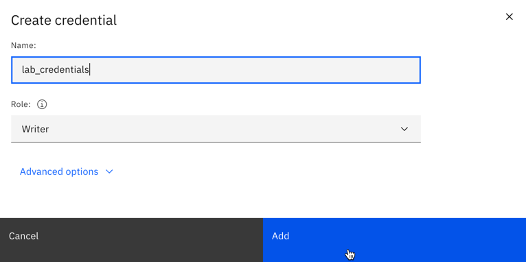

Your new credentials will appear in the list. Click the **copy button** to copy them to your clipboard.

Open your favorite text editor and paste the credentials into a new file. We will use them in a few different locations in later steps.

Next, you'll need a Cloud API key. Navigate to the [Cloud user API key page](https://cloud.ibm.com/iam/apikeys) and click the **Create an IBM Cloud API key** button.

Give your key a name and click the **Create** button.

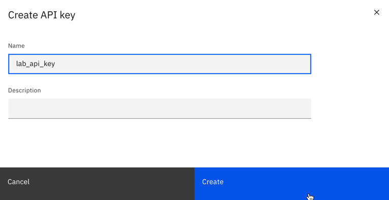

Click the **Copy** button to copy the key to your clipboard.

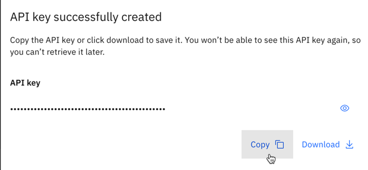

Paste the API key into your text editor file for later use.

Finally, you will need to create a Watson Studio project for your Python notebooks and models. Navigate to the [Watson Studio home page](https://dataplatform.cloud.ibm.com/) and click the **New project** button.

Click the **Create an empty project** tile.

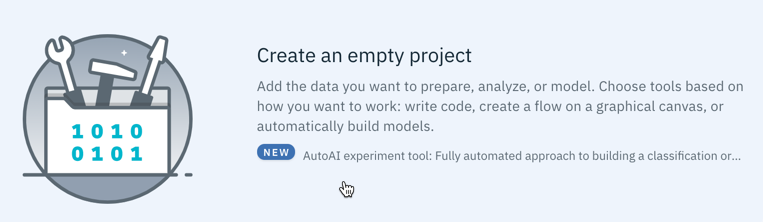

Give your project a name. In the **Define storage** section, select the Object Storage instance you created in the previous section, and then click **Create**.

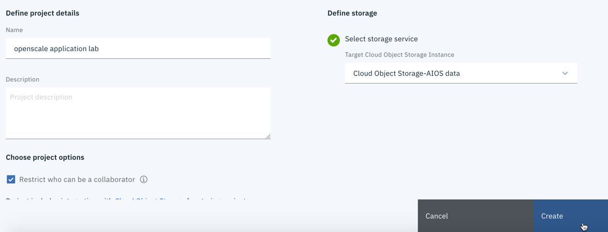

Click on the **Settings** tab at the top of the screen.

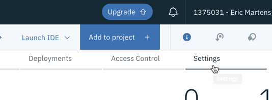

Scroll down to the **Associated services** section. Click the **Add service** button and select **Watson** from the list.

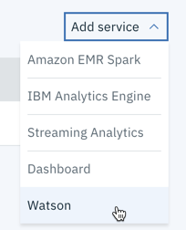

Click the **Add** button on the **Machine Learning** tile.

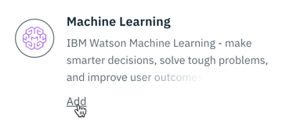

Select the instance of Watson Machine Learning you created in a previous step from the dropdown, and click the **Select** button.

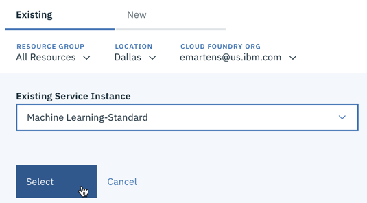

You are now ready to create a Watson Sudio project and run the notebooks.
